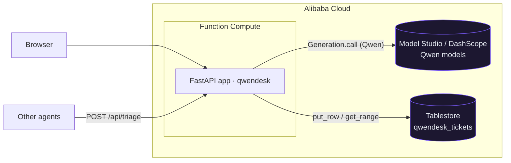

# Architecture

## Flow
1. A message arrives (browser form or `POST /api/triage`).
2. `app/qwen.py` calls **Qwen** via DashScope (`Generation.call`) and parses the JSON triage.
3. `app/store.py` writes the ticket to **Alibaba Cloud Tablestore** (`put_row`) and lists recent ones (`get_range`).
4. The dashboard renders the recent tickets.

## Data model (Tablestore `qwendesk_tickets`)
Composite primary key: `pk` = `"TICKET"` (partition) + `id` = inverse-timestamp string, so a forward range scan returns newest-first. Attribute columns: `message, category, priority, sentiment, summary, draft_reply, model, created_at`.

Both mandatory hackathon dependencies are exercised in code: **Qwen models** (`app/qwen.py`) and an **Alibaba Cloud backend** (`app/store.py`).
